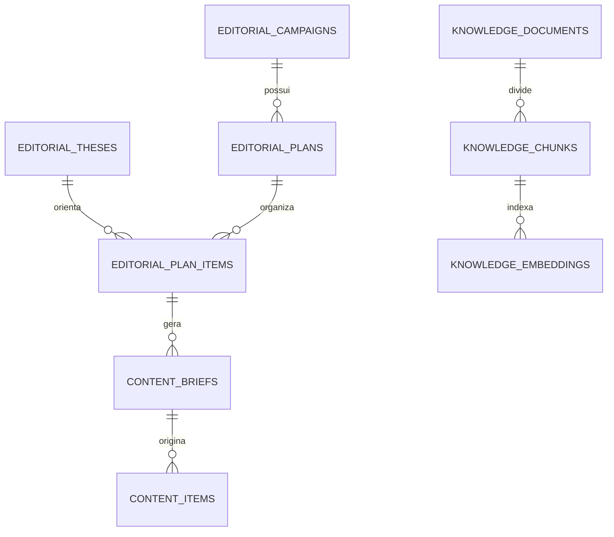

# Modelo de dados

```mermaid
erDiagram
  EDITORIAL_THESES ||--o{ EDITORIAL_PLAN_ITEMS : orienta
  EDITORIAL_CAMPAIGNS ||--o{ EDITORIAL_PLANS : possui
  EDITORIAL_PLANS ||--o{ EDITORIAL_PLAN_ITEMS : organiza
  EDITORIAL_PLAN_ITEMS ||--o{ CONTENT_BRIEFS : gera
  CONTENT_BRIEFS ||--o{ CONTENT_ITEMS : origina
  KNOWLEDGE_DOCUMENTS ||--o{ KNOWLEDGE_CHUNKS : divide
  KNOWLEDGE_CHUNKS ||--o{ KNOWLEDGE_EMBEDDINGS : indexa
```
